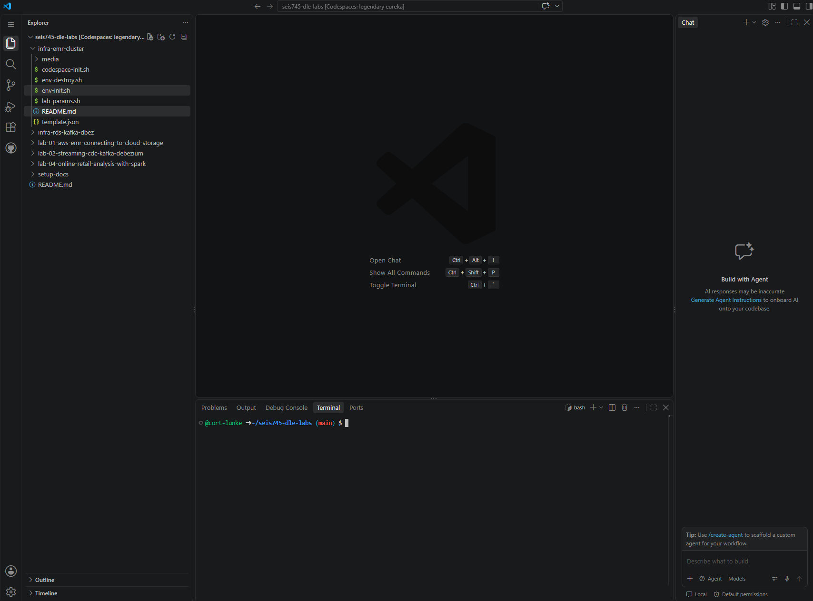
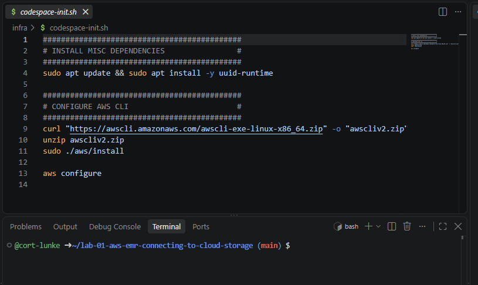
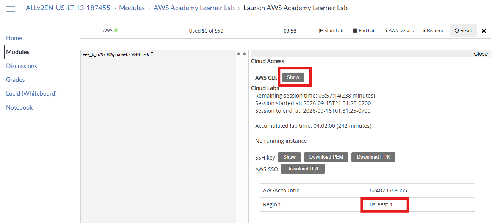
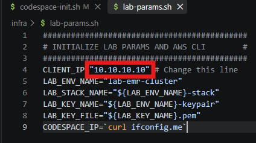
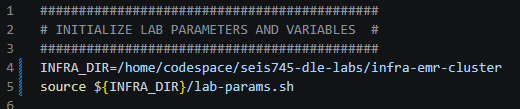

# Deploying a Data Lake environment: Cloud Storage and Elastic MapReduce compute with Hadoop and Spark

## Section 1: Installing lab dependencies and configuring AWS CLI in Codespace

Follow development environment setup instructions located in setup-docs
to ensure your AWS Academy Learner Lab is up and running, you are logged
into your GitHub Codespace, and you have cloned our lab repository:
[**https://github.com/UST-SEIS-745-DLE-Labs/seis745-dle-labs**](https://github.com/UST-SEIS-745-DLE-Labs/seis745-dle-labs).

1.  You should now see your Codespace environment along with the cloned
    lab repository. If you need to clone the repository, open the
    command pallet (Ctrl + Shift + P on Windows) and search 'Git Clone'.
    Enter the repository URL, clone from URL, and accept the default
    location. Open the repository rather than adding it to the
    workspace.

Your
Codespace should look something like this, possibly with a preview of
this readme open:

2.  The 'infra' directory holds necessary infrastructure as code (IAC)
    artifacts for setting up your Codespace and deploying to AWS. Open
    codespace-init.sh and execute this bash script line-by-line in your
    terminal leveraging copy and paste. Your first time pasting, you
    will be prompted to allow data from your clipboard.\
    

3.  Note that the script will update your Codespace VM (Ubuntu
    instance), install uuid-runtime for uuidgen, and install the
    AWS CLI. The last line prompts you to configure AWS details which
    you will need to retrieve from your AWS Academy Learner Lab. As with
    any terminal / shell / REPL interface, follow along as control
    passes from you (entering commands with Enter), to execution (you
    wait), and to the final output reaching stdout and control passing
    back to you. Once you see the familiar \$ dollar sign and cursor you
    are ready to submit the next command. Ctrl + C on Windows to cancel
    a command.

4.  After running aws configure, you are prompted for AWS CLI
    authentication and configuration details. You may grab these under
    AWS Details in your AWS Academy Learner Lab page. If you forgot to
    start your learner lab, start it now.

- AWS Access Key ID found under AWS CLI

- AWS Secret Access Key found under AWS CLI

- AWS Session Token found under AWS CLI

- Default region name: us-east-1

- Default output format: json

5.  Finally, open your lab-params.sh file and navigate to
    <https://checkip.amazonaws.com> in your browser. Replace the
    CLIENT_IP variable in lab-params with the IP address shown in your
    browser.

## Section 2: Create a Hadoop cluster using Amazon Elastic MapReduce (EMR), CloudFormation, and the AWS CLI

**Note:** when executing commands from lab-commands.sh do so line by
line. Be sure to observe the output on your terminal.

1.  Open infra/env-init.sh and inspect the shell script. Execute line by
    line as you go through the following instructions.

2.  The first section initialize lab environment variables from
    lab-params.sh.

3.  The second section has several steps:

    a.  Checks for existing S3 buckets in your AWS account leveraging
        the AWS CLI.

    b.  If no S3 bucket exists, create a new one with a unique ID
        leveraging uuidgen and the AWS CLI.

    c.  Append your IP address with /32, making it a valid single-IP
        CIDR value.

    d.  Creates a key pair to use when authenticating to EC2 (elastic
        compute cloud) instances. Modify permissions on the private key
        file to make it suitable for SSH authentication.

    e.  Runs an AWS CloudFormation deploy to stand up the EMR cluster
        defined in infra/template.json. This cluster has two worker
        nodes (and a driver node) running both Spark and HDFS. This step
        may take 15+ minutes as you provision a big data cluster from
        scratch.
