# Introduction

In this lab, we will be running Debezium on a remote EC2 instance to
capture changes from a MySQL instance hosted on Amazon Relational
Database Service (RDS). In addition, we will be streaming changes in
near real-time and storing them in S3. You will see streaming and cloud
storage services used in tandem to bring cloud data into a data lake.

We will continue to use a GitHub Codespace to automate infrastructure
deployment and interact with cloud resources.

# Pre-requisites

You should have a Codespace environment up and running **in your
browser** with the following git repository cloned and open:
https://github.com/UST-SEIS-745-DLE-Labs/seis745-dle-labs.

Additionally, you should be familiar with the infrastructure as code and
lab conventions we have used previously in class. When running the lab
you will be interactively copying lines from bash scripts and pasting
them into your bash terminal. Pay attention to the code you are
executing and the output as you learn how to automate infrastructure
deployment in AWS.

## Section 1: Clone or pull git repository and stand up lab infrastructure

Complete all steps within setup-docs to ensure your AWS lab environment is up and running, your GitHub Codespace is running and accessible in your browser, and you have either cloned ('git clone' in the CLI or command pallete) or pulled the latest changes ('git pull').  The repository url is [**https://github.com/UST-SEIS-745-DLE-Labs/seis745-dle-labs**](https://github.com/UST-SEIS-745-DLE-Labs/seis745-dle-labs)

The directory for this particular lab is **lab-01-aws-emr-connecting-to-cloud-storage**.

## Section 2: Deploy lab infrastructure

Infrastructure is managed in a separate repo folder for reusability.  This lab relies on the **infra-rds-kafka-dbez** folder.  Follow instructions in infra-rds-kafka-dbez/README.md (open in GitHub or Open Preview in VS Code / Codespace) to deploy necessary lab infrastructure.

# Section 3: Deploy and validate a MySQL source connector and an S3 sink connector on Kafka Connect

1)  Time to open and run lab-commands.sh. In this
    section, we will be deploying connectors to Kafka Connect leveraging
    its REST API. Make sure you have exited the EC2 instance and you see
    your GitHub account name in the terminal.

    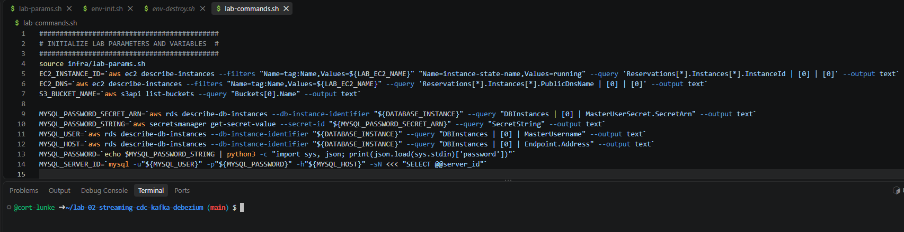

2)  Leverage curl to invoke the Kafka Connect REST API and create our
    source connector. Note that we are passing important database
    details including the host, user, and password. Additionally, we
    specify the databases and tables to include, as well as the location
    of our Kafka servers (among other configs).
**JSON request to create MySQL source
connector:**

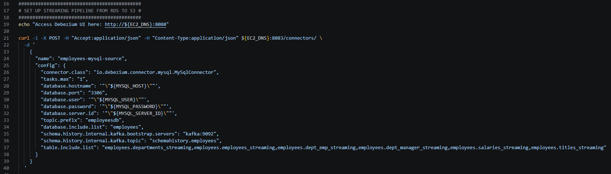

**API response:** 

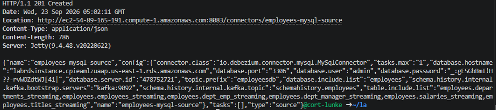

3)  Next, we'll start the sink connector to stream data from Kafka
    topics to AWS S3. Note that we are setting S3 details, the Confluent
    connector class, storage format for database events, topics for
    monitoring, the path to output in S3, and behavior for null values
    to capture delete events (among other configs).
**JSON request to create S3 sink
connector:**

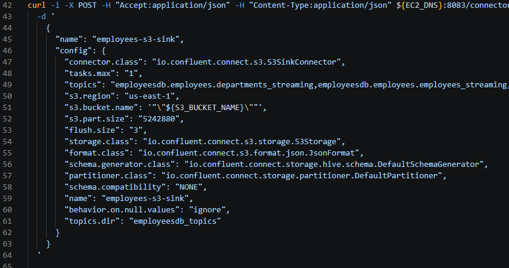

**API response:**

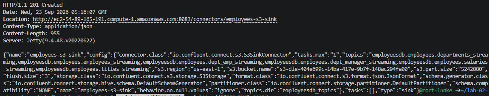

4)  Next, navigate to Debezium via the URL printed to your terminal. If
    you remembered to update and save lab-params.sh with your
    appropriate IP address then you will be able to access it fine. If
    you forgot, you may add a new firewall rule manually in the AWS
    console.

**Debezium URL:\**
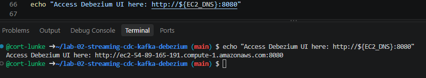

**Debezium UI:**
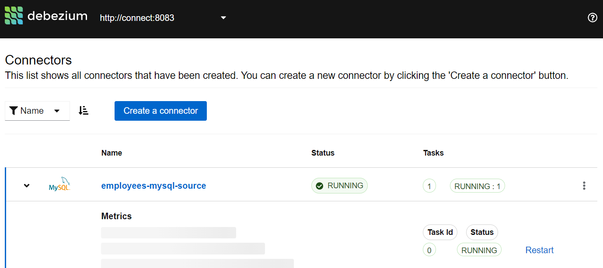

5)  The Debezium UI only shows the status of connectors and tasks for
    Debezium connectors at this time. We can leverage the API to check
    the status of both the MySQL source and S3 sink connectors.

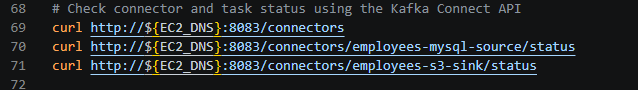

# Section 4: Validate create, update, delete, and read (snapshot) operations in MySQL and Debezium

1)  In this section, we will be performing create, update, and delete
    operations within our source database. If previous sections have
    been completed correctly, you should see events flowing from your
    SQL database all the way to your cloud storage in S3.

2)  Connect to your RDS instance using the MySQL command line interface.
    Input commands from sql-generate-sql-records.sql, starting with
    insert commands.

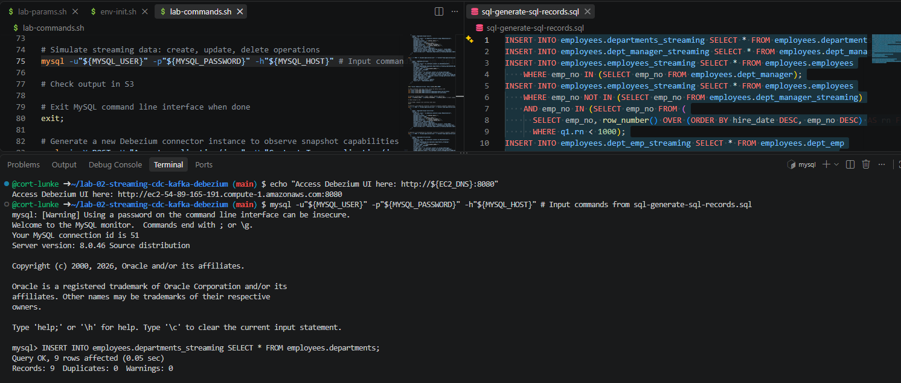

3)  Once all insert commands have completed, inspect the create events
    being stored in your S3 bucket at
    <https://s3.console.aws.amazon.com/s3>. Leverage the console to
    inspect, download, and view insert events. Note that the "before"
    state of the row is null for a create, while the "after" state will
    have the values for the new row. Inspect the other metadata
    associated with the new row including table name, database, log
    file, etc.

**Browsing your S3 bucket:**

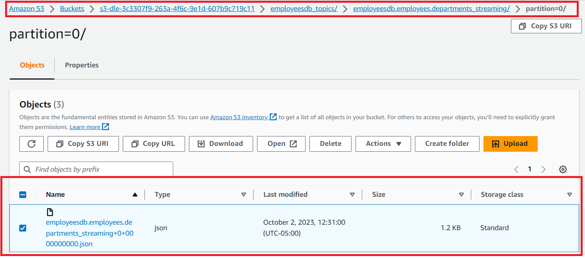

**Viewing insert event details:**

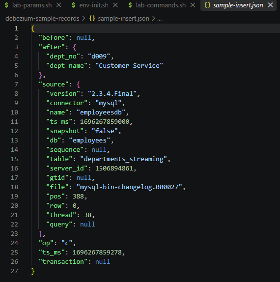

4)  Next, generate some update events. Business is good and we are
    giving managers a raise, increasing their salary by 10%. Note that
    this is for demo purposes only and we will not be leveraging
    from_date or to_date, but doing in-place updates on the
    salaries_streaming table:

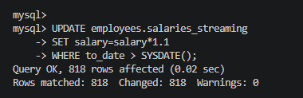

5)  Inspect the update events being stored in S3, taking note of the
    before/after state of the row and salary increase:

> 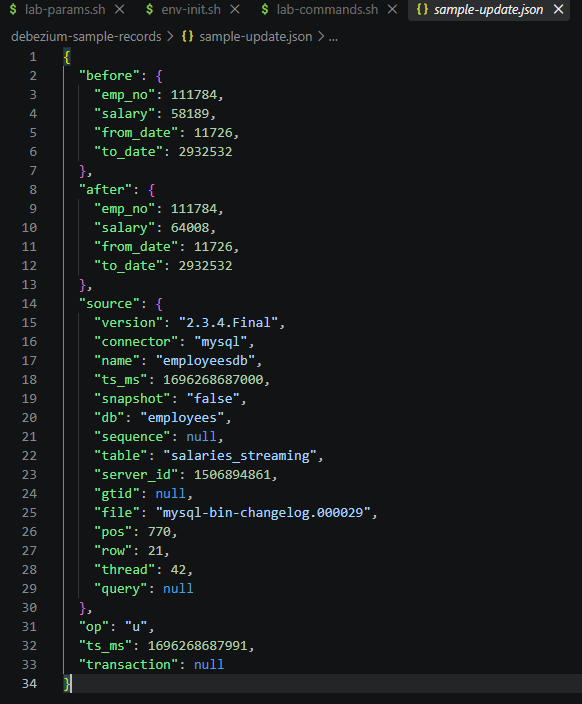

6)  Business is no longer strong and we will need to lay off some
    employees to cover the raises given to department managers. We
    unfortunately will be deleting some employees from the employees
    table and inspecting the delete events captured by Debezium and
    stored in S3.

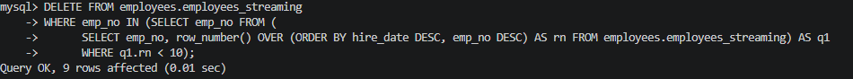

7)  Inspect the delete events propagated to S3:
    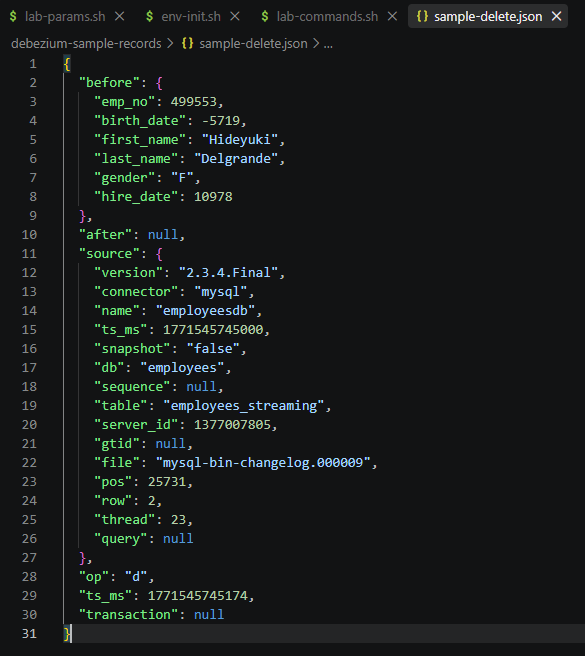

8)  Finally, we have a new data pipeline to set up. Let's inspect what
    happens when you deploy a new Debezium connector on existing tables.
    Note that you can exit the MySQL command line with the exit;
    command.

**New source connector:**

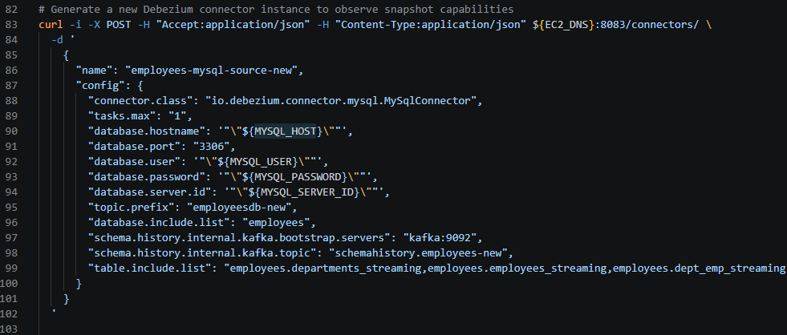

**New sink connector:**
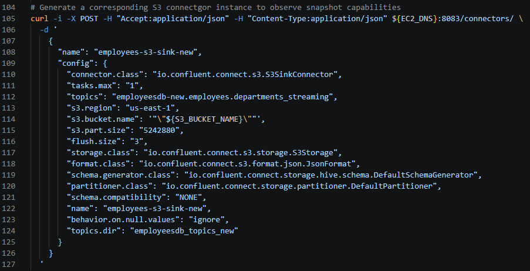

9)  Observe the new paths created in S3
    and note that all the new backend topics have been recreated for
    this new connector. Note that Debezium has propagated the current
    state of the tables in a snapshot read operation, leveraging an
    operation code of "r" (for read).

    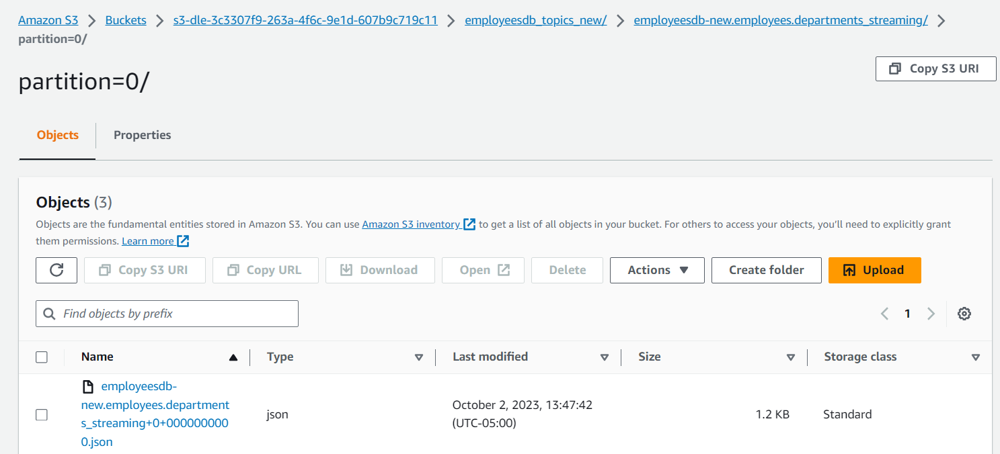

10) These are similar to create events but the "r" operation code
    indicates they have been created from an initial snapshot:

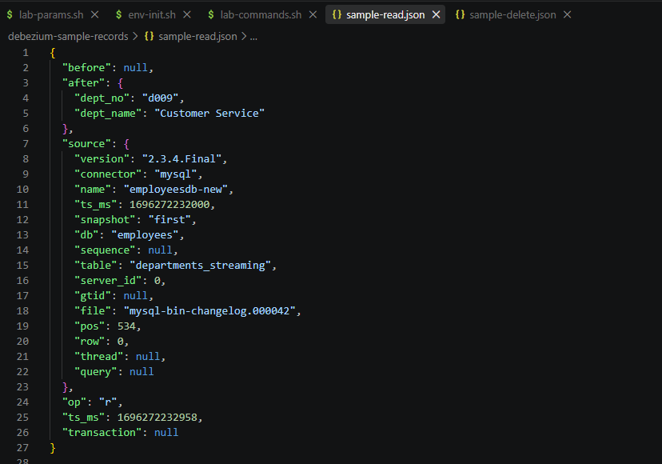

# Section 5: Remove lab resources

The infra-rds-kafka-dbez/env-destroy.sh script will clean up your lab resources including an:

- EC2 instance, associated keypair, and associated security group

- RDS instance, associated security group, and associated parameter
  group

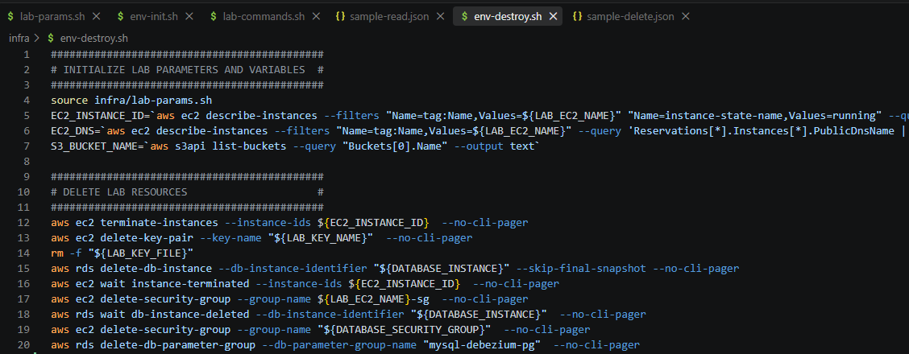

# Conclusion

In this lab, you were able to perform data collection from a cloud SQL
data source all the way to cloud storage leveraging a mature streaming
architecture. By combining Kafka topics with native Kafka Connect
capabilities and third-party Debezium and Confluent connectors, you were
able to build an architecturally elegant, low-code, resilient streaming
solution for your data lake. In later labs we will not only collect but
also prepare and analyze data streams in a data lake environment.
