## 

## 

## Introduction 

In this homework you will first walk through a guided lab section to
stand up a Hadoop cluster on Amazon Elastic MapReduce (EMR) running one
master node and two data nodes. Then, you will use Spark to move data
from the MySQL database running on the Hadoop master node to your S3
storage bucket. Finally, you will complete the homework assignment by
using Spark RDDs to answer some questions regarding an online retail
dataset.

## Pre-requisites

As a prerequisite to this lab section you should have access to our
class AWS environment and an Amazon Cloud9 development environment up
and running.

## Section 1: Clone or pull git repository and stand up lab infrastructure

Complete all steps within setup-docs to ensure your AWS lab environment
is up and running, your GitHub Codespace is running and accessible in
your browser, and you have either cloned ('git clone' in the CLI or
command pallete) or pulled the latest changes ('git pull').  The
repository URL is
[**https://github.com/UST-SEIS-745-DLE-Labs/seis745-dle-labs**](https://github.com/UST-SEIS-745-DLE-Labs/seis745-dle-labs).

The directory for this lab is lab-04-online-retail-analysis-with-spark.

## Section 2: Deploy lab infrastructure

Infrastructure is managed in a separate repo folder for reusability.
 This lab relies on the 'infra-emr-cluster' folder.  Follow instructions
in infra-emr-cluster/README.md (open in GitHub or Open Preview in VS
Code / Codespace) to deploy necessary lab infrastructure.

## Section 3: Take a look at the new infrastructure then transfer files and connect to the Hadoop master node

1.  Navigate to the EC2 instances page. You should have three EC2
    instances either starting or running. Note that these were created
    when we deployed our CloudFormation template above. Specifying
    infrastructure in formats like AWS CloudFormation is known as
    infrastructure as code (IAC). This helps keep infrastructure under
    version control and in sync between environments. It also makes it
    easy to destroy and recreate infrastructure.

> EC2 instances at <https://console.aws.amazon.com/ec2>:

- A single Hadoop master node

- Two Hadoop data nodes

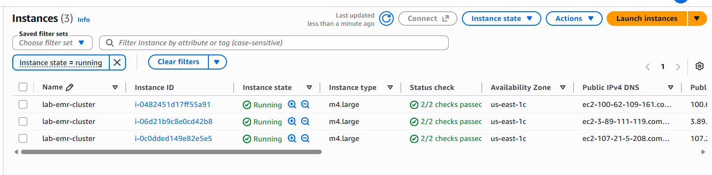

2.  Find the S3 bucket that was created as part of your CloudFormation
    deployment. Note the bucket name for later in the lab. Navigate to
    the S3 service either by navigating the AWS management console or
    navigating directly to <https://console.aws.amazon.com/s3>.

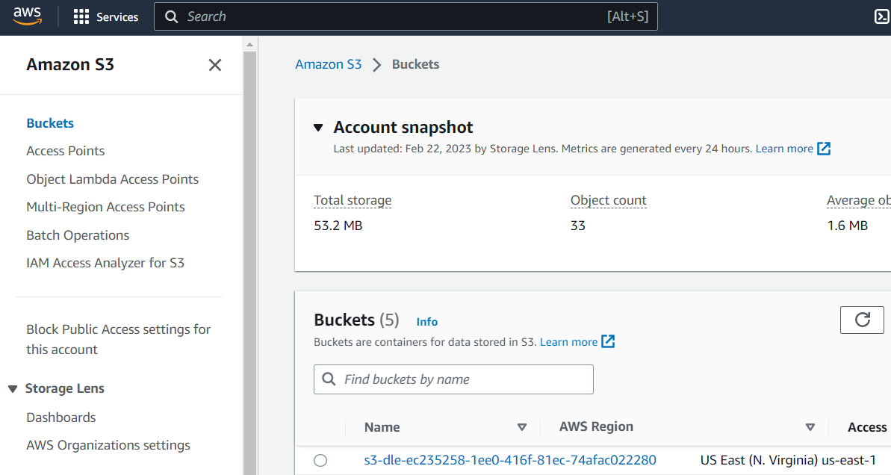

3.  The following commands initialize lab parameters, query our existing
    S3 bucket name, leverage the AWS CLI to identify the ID for our
    running Hadoop cluster, pause execution until the cluster is
    running, and query the public host (DNS) name of the master node.
    Then, we use the private key we created earlier to transfer files
    over scp and connect to the remote master node over ssh.

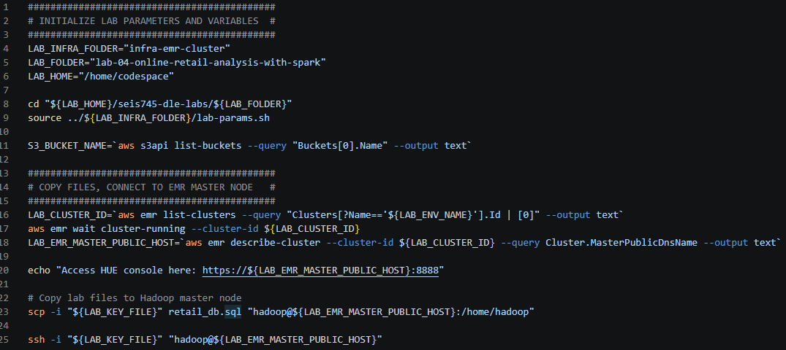

4.  Take note of the HUE URL printed to the console. You will need this
    later in the lab:

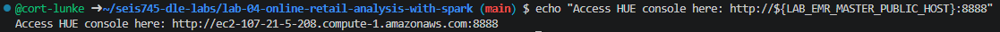

## Section 4: Getting started with Spark: Inspecting the database

1.  In this section, we will use the local **mysql** database running on
    the Hadoop master node as our data source. First, make sure you are
    connected to the EMR master node:

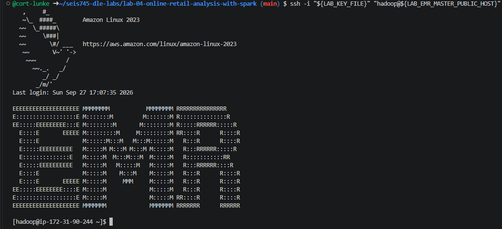

2.  Try to connect to the local mysql database using the **mysql**
    command line, passing in the username and password. Then, create a
    spark user for use by the Spark runtime and grant it all privileges
    on the database. Finally, run a command to initialize the retail_db
    database used in this lab and execute a test query.

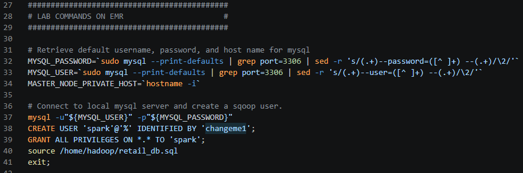

3.  Set some environment variables for Spark:

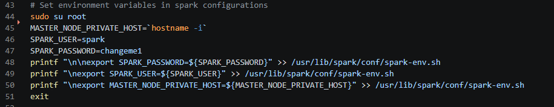

4.  Now let's try connecting using the pyspark command line interface
    and the new user we created:

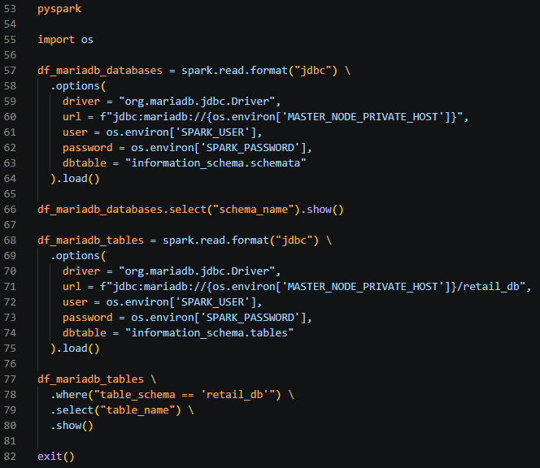

In the bash terminal:

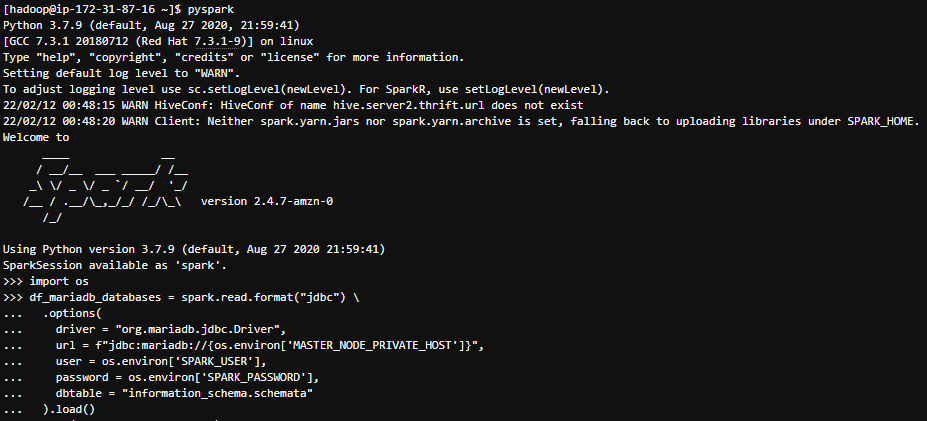

5.  Passing a password from environment variables is insecure. With a
    few simple hdfs and hadoop commands, let's secure our password in a
    Java keystore. Then, we'll configure Spark to use the password from
    that keystore to connect to the database. Finally, we can use the
    password alias from the keystore in our Spark application,
    eliminating the need for passing the password directly as an
    environment variable.

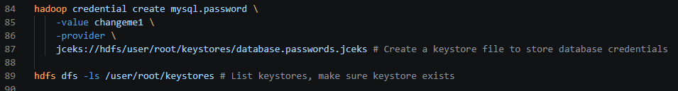

## Section 5: Read relational data into S3 using Spark

1.  In this section, you will collect retail_db data from a MySQL
    database and write it to your S3 bucket using Spark. Start by using
    the PySpark REPL (read, execute, print, loop) interface to import
    the orders table from our retail_db schema and save it as a CSV file
    in Hadoop.

2.  Initialize the pyspark shell again, this time leveraging the secure
    credential store we created in HDFS and passing in the name of our
    S3 bucket:

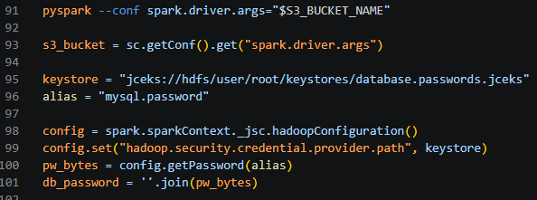

3.  Create a function for importing tables into S3:

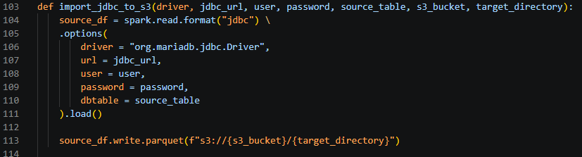

4.  After importing all retail_db tables, exit the pyspark shell and
    exit one more time to return control back to your GitHub Codespace
    session:

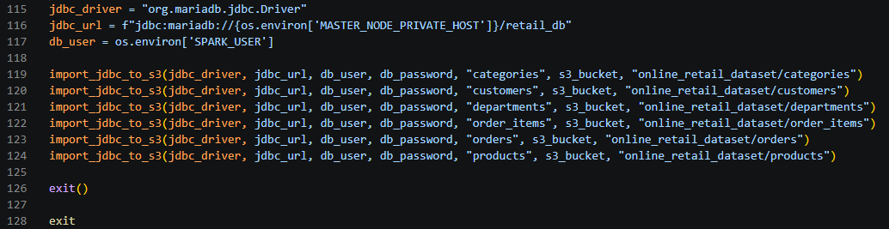

## Section 6: Analyze data leveraging Spark RDDs and Hue

1.  With your EMR cluster up and running and transactional data
    replicated to S3 in parquet format, you’re ready to analyze that
    data using Spark RDDs.

2.  Find the public hostname for your EMR master node. You may find this
    printed to standard out in an earlier section of this lab, or in the
    Summary section of your EMR cluster in the AWS management console.

An example URL will be
<http://ec2-1-11-11-11.compute-1.amazonaws.com:8888>. Note that you will
have to change the domain name to match yours.

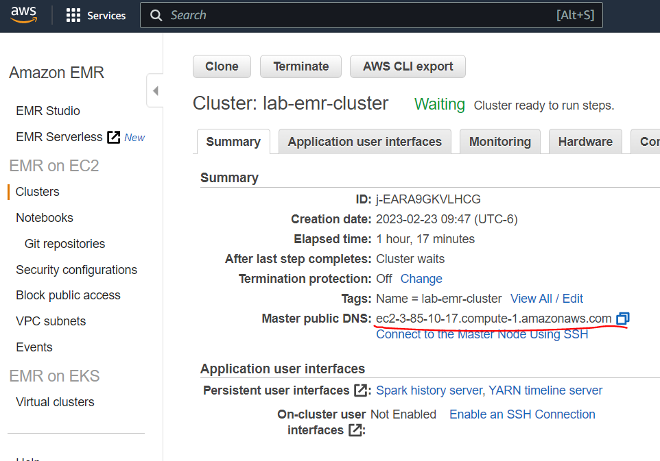

3.  Log into the Hadoop User Experience (Hue) application running on the
    master node. It is running on port 8888 and may be accessed through
    your browser. Your first time logging in you will need to configure
    a username and password.

4.  

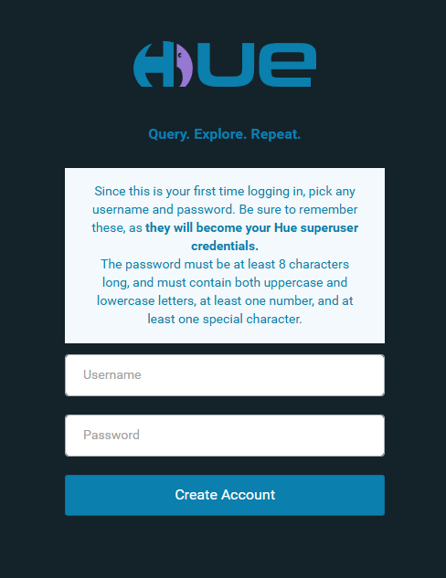

**Note:** If you are having trouble connecting to Hue, double check the
inbound rules in the security group for your EMR master node. You may
have forgotten to update your IP address in section 1.

5.  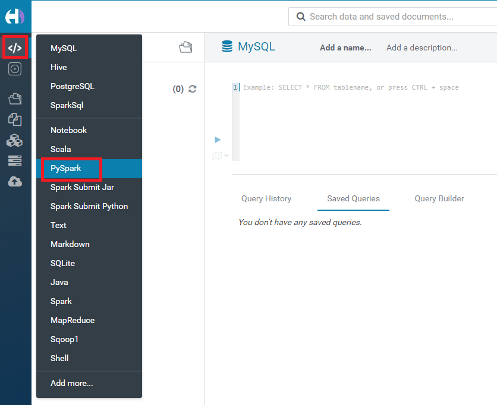Select
    the PySpark code editor but note the other options that are
    available to you in Hue:

6.  There is some code to get you started in the retail-analysis.py
    python script included with this lab. Update your S3 bucket name in
    line 1 of the script. Inspect and execute this code which reads
    online retail data from S3 into an RDD, then leverages RDD
    operations to determine the highest product sold by volume.

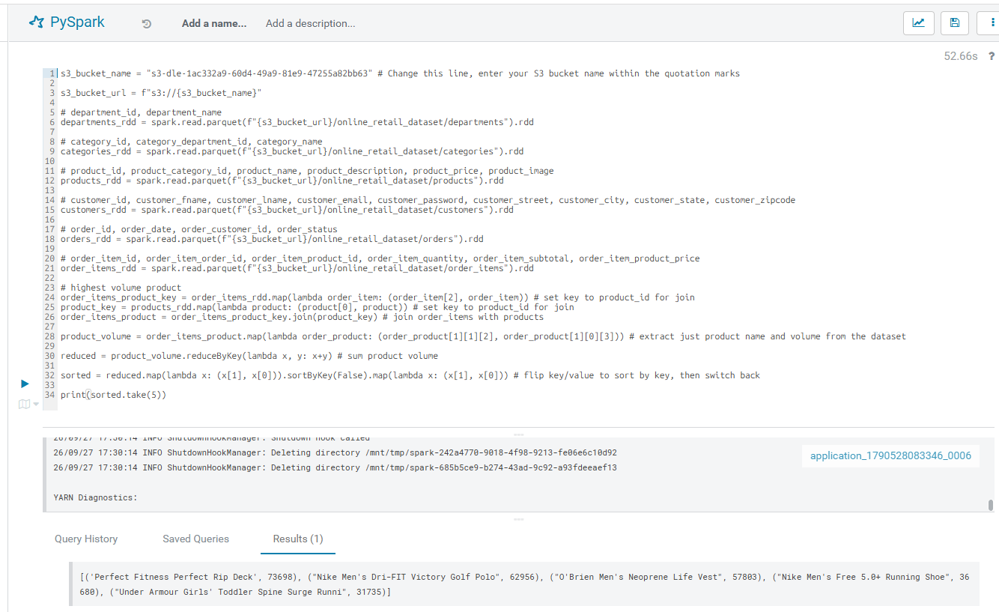

7.  Finally, analyze the online retail dataset on your own to complete
    the homework assignment included with these instructions.

## Section 7: Destroying your Amazon EMR Cluster

1.  Ensure you have completed the requirements of this assignment before
    deleting your cloud resources.

2.  The ../infra-emr-cluster/env-destroy.sh script will clean up lab
    resources, ensuring your AWS environment is left in a clean state
    when you start the next lab or decide to rerun the current lab. Note
    that EMR clusters are ephemeral; once terminated there is no
    restarting them. Instead, you deploy a new cluster the next time you
    need it.

3.  Finally, reflect on the lab and dig into some of the supporting
    files that we used automatically deploy and configure our EMR
    environment.

• retail_db.sql borrowed to put sample data in our mysql database

• template.json used to specify in JSON and AWS CloudFormation format
the infrastructure used by our lab.
